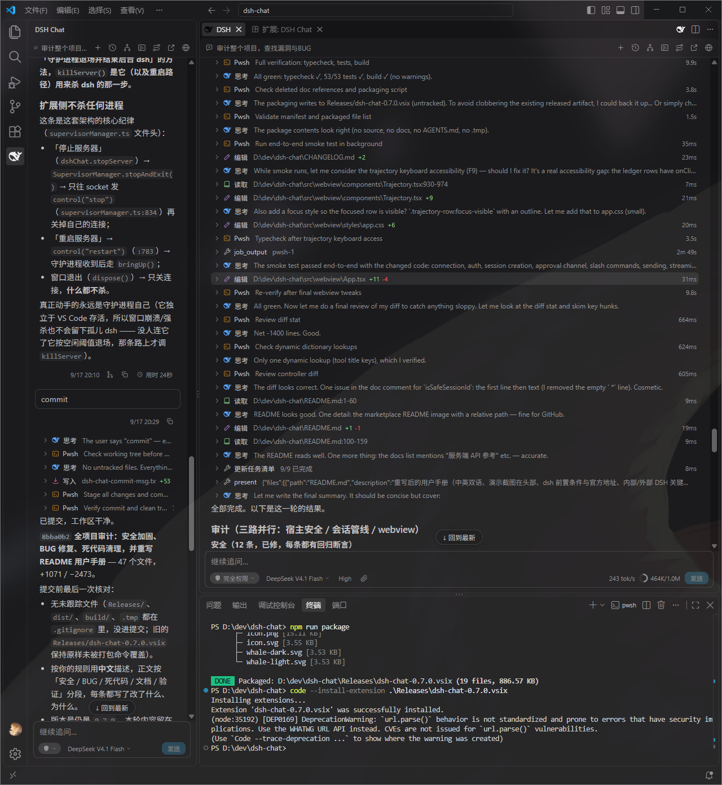

# DSH Chat



在 VS Code 里用 [DeepSeek Harness](https://github.com/deepseek-ai/deepseek-harness)（`dsh`）对话的第三方扩展。

界面由扩展**自己绘制**（自绘 webview，不嵌入网页），会话与工具能力全部来自 `dsh`，
与官方 DSH Web UI 的数据语义保持一致——它是一套标准的 Chat 界面，只是长在 VS Code 里。

[English](#english) | 简体中文

---

## 前置条件：先装 `dsh`

本扩展是 `dsh` 的**前端**，自己没有模型能力，**必须先安装 dsh**：

```bash
npm i -g @deepseek-ai/dsh     # 官方仓库：https://github.com/deepseek-ai/deepseek-harness
```

- dsh 自己的模型凭据要配好（`dsh` 首次使用会引导，或直接改 `~/.dsh` 下的配置）。
- VS Code ≥ 1.101（辅助侧栏容器需要 ≥ 1.106，旧版本自动回退到活动栏）。

## 安装

**从 VSIX**（自己打包）：

```bash
npm install
npm run package          # 产出 Releases/dsh-chat-<version>.vsix
```

VS Code → 扩展 → `…` → 从 VSIX 安装 → 重载窗口。

**从源码调试**：`npm install && npm run watch`，用 VS Code 打开本仓库按 `F5`。

## 关键：内部自管理的 DSH，还是连外部 DSH

| `dshChat.url` | 行为 |
| --- | --- |
| **留空**（默认） | 扩展按 `dshChat.command` **启动并托管一套内部 DSH**（`dsh web` 子进程 + 一个独立守护进程）。启动令牌由扩展自行解析，不需要手动填。 |
| **填了地址** | 扩展**不启动任何 DSH**，只连这个地址。服务器要授权时弹框输入访问令牌（`dsh web` 启动 URL 里 `?token=` 之后那段），也可以用命令面板 **DSH: 输入访问令牌**。 |

再补三条容易踩的口径：

- **多个 VS Code 窗口共用同一个后台**：扩展按**有效配置**（`url` + `command`）给窗口分组，
  同一组的窗口共用一套守护进程与同一个 `dsh web`——不是每个窗口各起一个。同一份用户设置
  下所有窗口天然同组；远端窗口、不同配置档（Profile）、Insiders/Stable 各写各的 `command`
  时是**不同的组**，各用各的后台。守护进程按**活连接数**决定何时收场（默认空闲 10 秒，
  可配），所以「重载窗口 / 重开 VS Code」不会杀掉后台，正在跑的会话也不会因此中断。
- **`url` 与 `command` 是 `machine` 作用域**：只能在**用户设置**里改，工作区的
  `.vscode/settings.json` 覆盖不了它们（`command` 是经 shell 执行的命令、`url` 决定
  凭据发往哪个服务器——这两件事不该由克隆来的仓库决定）。
- **改这两项要重载窗口**才生效（扩展会弹提示）；其余配置项改完即时生效。

## 配置

| 键 | 默认 | 说明 |
| --- | --- | --- |
| `dshChat.url` | 空 | 外部 `dsh web` 地址；留空则由扩展自己启动并托管一套（见上表） |
| `dshChat.command` | `dsh web --port 0 --no-open` | 启动内部服务器的命令，**原样执行**、扩展不追加任何参数 |
| `dshChat.supervisorIdleSec` | `10` | 没有窗口连着之后，守护进程隔多久收场（5–600 秒） |
| `dshChat.autoStart` | `true` | 启动 VS Code 时自动连接；关掉后后台不存在时只显示「启动服务器」按钮，扩展绝不自己拉起 |
| `dshChat.diffLayout` | `auto` | 编辑类节点的 diff 排版：`auto`（窄单栏 / 宽双栏）、`unified`、`split` |
| `dshChat.language` | `auto` | 聊天界面语言：`auto` 跟随 VS Code、`zh-cn`、`en` |
| `dshChat.fontSize` | `0` | 聊天界面字号（整数 px，≥8）；`0` 跟随 VS Code 字号 |
| `dshChat.questionBatch` | `3` | 一份问卷一次展开几道题；更多题目改为依次问答，`0` = 始终全部展开 |
| `dshChat.turnProcessThreshold` | `5` | 一轮结束后，过程段内工具调用（含 subagent 派发）达到该数量才折成一枚按钮；`0` = 永不折叠，`1–2` = 永远折叠（仅 1 次调用的段照旧平铺） |

## 用法要点

**打开与切换**：活动栏 / 辅助侧栏各有一个容器，也可以把对话开进编辑器区面板
（命令面板 **DSH: 在编辑器中打开对话**；编辑器标题栏右上角那颗鲸鱼按钮会在**当前分组**里
新开一个会话）。历史对话、新建、归档、删除都在界面里。

**输入与引用**：

- `/` 弹出命令与技能菜单；`@` 弹出文件 / 目录 / **历史对话**候选。选中即把
  `@path` / `@dir/` / `@[标题](dsh-session:…)` 写进正文——这是**路径引用**，
  模型自己用 `read` 工具读，不占附件通道。
- 回形针与拖放是**附件**通道：图片按内容块发送，其余文件逐字节上传（芯片上显示进度）。
  编辑器里选中代码后 **Alt+Shift+2** 加的是 `@path#L12-L40` 这样的**选区引用**。
  拖放进 webview **必须按住 `Shift`**（VS Code 的 iframe 拖拽门，见「已知限制」）。
- 会话里**看得见图**：你发出的图片显示为缩略图，模型或工具回带的图（含 `read_image`）
  同样；agent **交付或生成**的图片文件（`present` 申报的、本轮写出来的 `.png`/`.jpg`/`.svg`）
  也画成图；正文里引用的图片同样会渲染——工作目录内的本地路径由扩展读成图（越界路径不读），
  `https://` 外链按原样加载但不带来源信息。点任意一张图可看原图，`Esc` 关闭。

**过程与交互**：工具调用压成单行（点开看完整参数、结果、结构化 diff），运行中的节点
有呼吸效果与实时耗时；审批、问卷（题多时依次问答）、计划审阅（`exit_plan_mode`）各有
专属卡片；停止生成用按钮或 `Esc`（队列非空时 `Esc` 会中止当前轮并发出队首消息）。

**面板**：历史对话（只列当前工作区的会话）、子代理、后台任务、**轨迹**（账本 + 时间线 +
详情检查器，与官方同一套折叠口径）。dsh 服务端自己的设置页**没有自绘**——用界面里的
「在浏览器中打开」直接改 Web UI 的设置。

**其它**：中英双语（跟随 VS Code 显示语言）；上下文占用圆环、目标条、轮次横条；
「从这里分支」；消息与展开状态跟着工作区记忆（存在 VS Code 自己的工作区缓存里，
不往项目目录写文件）；Markdown 支持 GFM 任务列表 / 表格 / 脚注，**不做**公式与代码高亮
（取舍见 `THIRD-PARTY-NOTICES.md`）。

## 开发与验证

```bash
npm run typecheck      # 宿主与 webview 两套 tsconfig
npm test               # 离线断言（53 套，并行跑）
npm run build          # 生产构建（dist/）
npm run smoke          # 端到端冒烟：真实拉起 dsh、真实调一次模型
npm run preview        # 浏览器里预览 webview 产物 http://127.0.0.1:8777/test/preview.html
npm run package        # 打成 vsix
```

`docs/` 下是实现与审计文档（与官方 Web 的逐条对照、supervisor 设计、轨迹规格、
服务端 API 参考）；`scripts/` 下是断言与诊断探针。改代码前请先读 `AGENTS.md`。

## 已知限制

- **不是** `dsh web` 的复刻：不嵌入网页、不自绘服务端设置页（走浏览器打开）；
  子代理面板与官方仍有差距（耗时列、`hasChildren` 树等，数据齐、缺呈现）。
- **拖文件进 webview 必须先按 `Shift`**：webview 是 iframe，VS Code 在主窗口上监听拖拽，
  没按 `Shift` 就给 iframe 挂 `pointer-events: none`。从系统资源管理器拖同样受影响。
  拖放按字节上传，单文件上限 8 MB，目录不支持（用回形针或 `@`）。
- 停止语义与官方契约有一处刻意偏离（`Esc` = 由客户端摘空队列 → cancel → 按原序重发），
  依据是实测：只 cancel 不会让队列自行接续。
- 面板/窗口状态恢复依赖 VS Code 自己的工作区缓存与 `window.restoreWindows` 设置。
- 服务端协议无版本协商：本项目针对 DSH `0.1.5-rc.1` 实测。

## 许可与归属

本项目以 **MIT** 许可发布，见 `LICENSE`。完整、逐项的披露见
[`THIRD-PARTY-NOTICES.md`](THIRD-PARTY-NOTICES.md)：协议类型取自 DeepSeek Harness（MIT）；
DSH 传输层的结构写法继承自 DeepSeek-Harness-for-VS-Code（MIT）；界面在早期参考过
Continue 的视觉与交互取向（Apache-2.0），**未拷贝其源码**，如今已按本扩展自己的
设计 token 与样式自绘、不再以它为类比。

欢迎 issue 与 PR。提交前请确保 `npm run typecheck` 与 `npm test` 通过。

---

<a id="english"></a>

# DSH Chat


A third-party VS Code extension for [DeepSeek Harness](https://github.com/deepseek-ai/deepseek-harness) (`dsh`).

The extension **draws its own UI** (a self-rendered webview — no embedded browser page) and
takes every conversational capability from `dsh`, with the same data semantics as the official
DSH Web UI: a standard chat experience, living inside VS Code.

## Prerequisite: install `dsh` first

DSH Chat is a **frontend**; it has no model access of its own. Install `dsh` first:

```bash
npm i -g @deepseek-ai/dsh     # official repo: https://github.com/deepseek-ai/deepseek-harness
```

Configure your model credentials for `dsh` as usual.
VS Code ≥ 1.101 (the secondary-sidebar container needs ≥ 1.106; older versions fall back to the
activity bar).

## Install

```bash
npm install
npm run package        # produces Releases/dsh-chat-<version>.vsix
```

Then in VS Code: Extensions → `…` → Install from VSIX → reload. To hack on it:
`npm install && npm run watch`, open this repo in VS Code and press `F5`.

## The key setting: managed vs external DSH

| `dshChat.url` | Behaviour |
| --- | --- |
| **empty** (default) | The extension starts and supervises its own DSH (`dsh web` child plus a standalone guardian process). The launch token is parsed automatically. |
| **set** | The extension starts **no** DSH at all; it only connects to that address. If the server requires authorization it prompts for the access token (the `?token=` value from the `dsh web` launch URL), or use **DSH: Enter Access Token** from the Command Palette. |

Three rules worth knowing:

- **Multiple VS Code windows share one backend**: windows are grouped by their **effective**
  `url` + `command`, and one group shares a single guardian + `dsh web` — not one per window.
  With a single set of user settings every window lands in the same group; remote windows,
  different profiles, or Insiders/Stable with their own `command` form **separate** groups with
  separate backends. The guardian retires a backend once nobody is connected (10s idle by
  default, configurable), so reloading a window or restarting VS Code never kills it.
- **`url` and `command` are `machine`-scoped**: they can only be set in *user* settings; a
  workspace's `.vscode/settings.json` cannot override them (`command` is executed through a
  shell and `url` decides where credentials go — a cloned repository must not decide either).
- **Changing them requires a window reload** (the extension offers to do it); every other
  setting applies immediately.

## Settings

| Key | Default | Meaning |
| --- | --- | --- |
| `dshChat.url` | empty | Address of an external `dsh web`; empty = manage our own (see above) |
| `dshChat.command` | `dsh web --port 0 --no-open` | Launch command for the internal server, executed verbatim |
| `dshChat.supervisorIdleSec` | `10` | Idle seconds before the guardian retires the backend (5–600) |
| `dshChat.autoStart` | `true` | Connect on start; when off, the extension never launches a backend by itself — it just offers a "Start server" button |
| `dshChat.diffLayout` | `auto` | Diff layout for edit calls: `auto`, `unified`, `split` |
| `dshChat.language` | `auto` | Chat UI language: `auto` (follow VS Code), `zh-cn`, `en` |
| `dshChat.fontSize` | `0` | Chat UI font size in px (≥8); `0` follows VS Code |
| `dshChat.questionBatch` | `3` | Questions shown at once; more than this are asked one at a time; `0` = always all |
| `dshChat.turnProcessThreshold` | `5` | Fold a finished turn's consecutive process into one button once it holds this many tool calls (subagent dispatches count); `0` = never fold, `1–2` = always fold (a run with a single call stays flat) |

## Using it

**Windows** — an activity-bar view, a secondary-sidebar view, and an editor-area panel
(**DSH: Open in Editor**, or the whale button in the editor title bar, which opens a fresh
session in the group you are in). History, new chat, archive and delete all live in the UI.

**Input** — type `/` for commands and skills, `@` for files, folders and **past sessions**
(they insert a plain `@path` / `@dir/` / session mention that the model resolves itself).
The paperclip and drag-and-drop are the *attachment* channel: images go as content blocks,
everything else uploads byte-by-byte with progress on the chip. `Alt+Shift+2` adds the
selected lines as a `@path#L12-L40` reference. **Dropping files into the webview requires
holding `Shift`** (a VS Code iframe-drag gate, see Limitations).
Conversation images are visible: your own images render as thumbnails, and so do images the
model or a tool returns (including `read_image`). Image files the agent **delivers or generates**
(declared via `present`, or written this turn as `.png`/`.jpg`/`.svg`) are drawn as images too,
as are images referenced in the answer — a local path inside the session working directory is read
by the extension (paths outside it are not), while `https://` links load as-is with no referrer.
Click any image to view the original; `Esc` closes it.

**During a turn** — tool calls collapse to one line (expand for arguments, results, a
structured diff), running calls glow and show a live elapsed timer; approvals, questionnaires
(asked one at a time when long) and plan review (`exit_plan_mode`) get dedicated cards;
`Esc` stops generation, and with messages queued it stops the turn and sends the frontmost one.

**Panels** — history (current workspace only), subagents, background jobs, and **Trajectory**
(ledger + timeline + inspector, folded exactly like upstream). The server's own settings page
is **not** re-implemented: use "open in browser" to edit it in the DSH Web UI.

**Also** — bilingual UI following the VS Code display language; context-usage ring, goal bar,
turn rail; branch-from-here; per-workspace window/session memory (stored in VS Code's own
workspace cache, never in your project); Markdown with GFM task lists, tables and footnotes,
deliberately **without** math or syntax highlighting (`THIRD-PARTY-NOTICES.md` has the rationale).

## Development

```bash
npm run typecheck   # host + webview tsconfigs
npm test            # 53 offline assertion suites, in parallel
npm run build       # production build into dist/
npm run smoke       # end-to-end: starts a real dsh, makes a real model call
npm run preview     # preview the webview at http://127.0.0.1:8777/test/preview.html
npm run package     # build a vsix
```

`docs/` holds the implementation/audit documentation (upstream parity audit, supervisor design,
trajectory spec, server API reference); `scripts/` holds the assertions and diagnostic probes.
Read `AGENTS.md` before changing code.

## Limitations

- Not a replica of `dsh web`: no embedded page, no self-drawn server settings page, and the
  subagent panel still lacks a few upstream columns (duration, `hasChildren` tree).
- **Dropping files into the webview requires `Shift`** (VS Code blocks iframe pointer events
  during a drag otherwise); drops upload as bytes, 8 MB per file, folders unsupported.
- Stop semantics deviate from the upstream contract on purpose (`Esc` = client-side queue
  drain → cancel → resend in order), because a bare cancel measurably does not resume the queue.
- Panel/window restore depends on VS Code's workspace cache and `window.restoreWindows`.
- No protocol version negotiation: measured against DSH `0.1.5-rc.1`.

## Licence and attribution

MIT — see `LICENSE`. The full itemised disclosure is in
[`THIRD-PARTY-NOTICES.md`](THIRD-PARTY-NOTICES.md): protocol types come from DeepSeek Harness
(MIT); the DSH transport layer inherits its structural approach from
DeepSeek-Harness-for-VS-Code (MIT); the interface was guided early on by Continue's visual and
interaction design (Apache-2.0) **without copying its source**, and is now drawn from this
extension's own design tokens rather than held up as a Continue clone.
